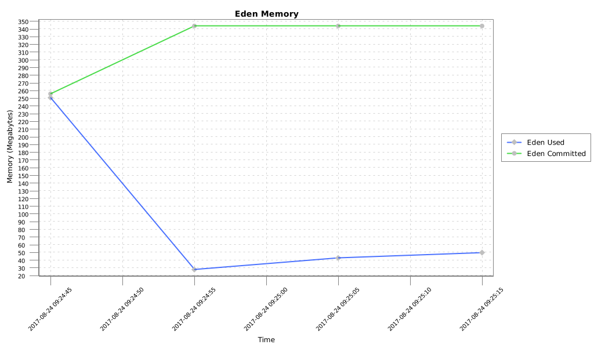
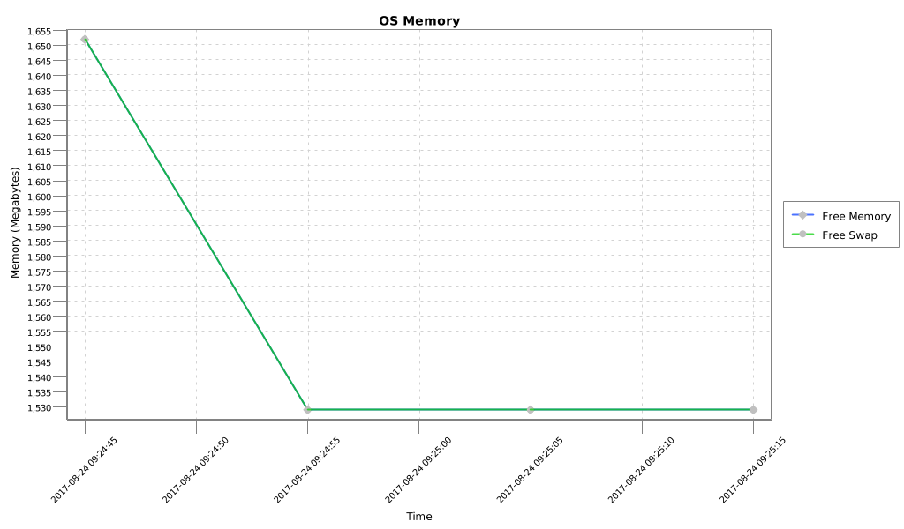
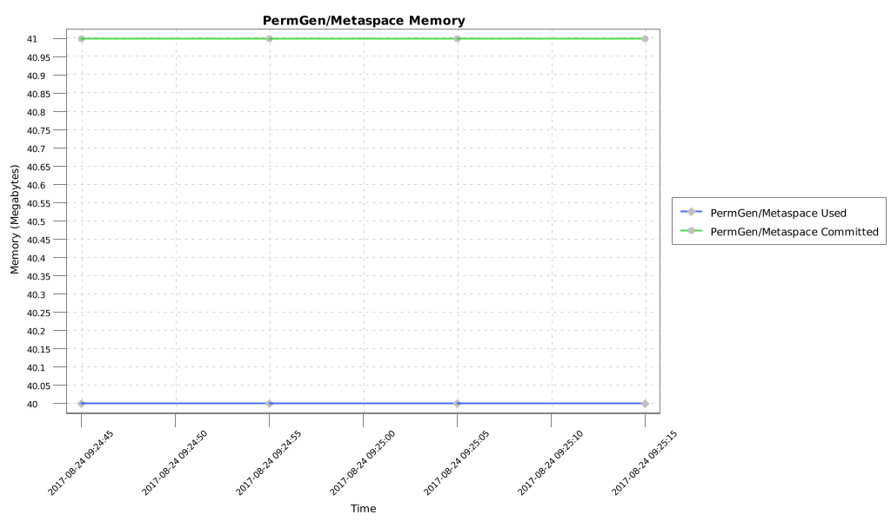
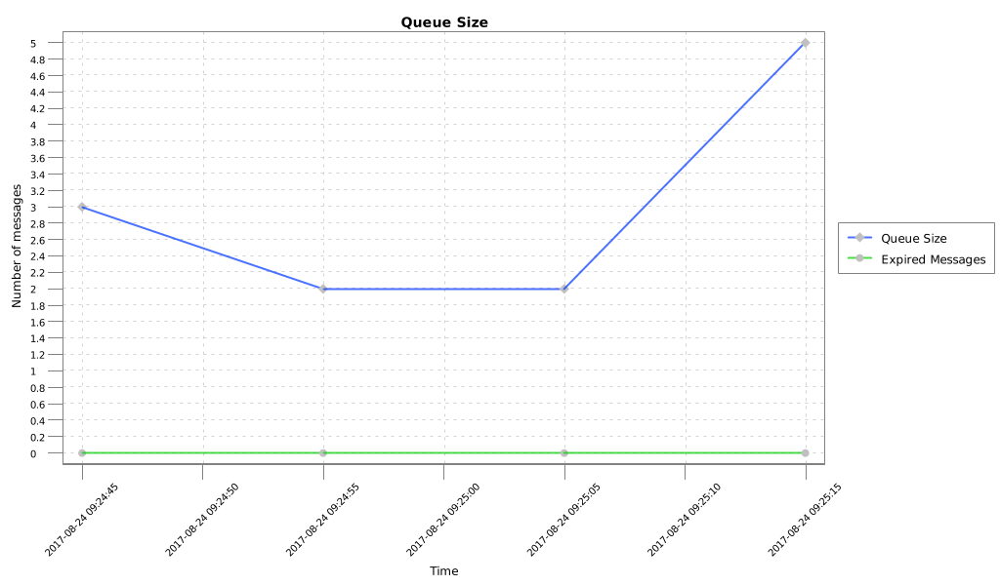
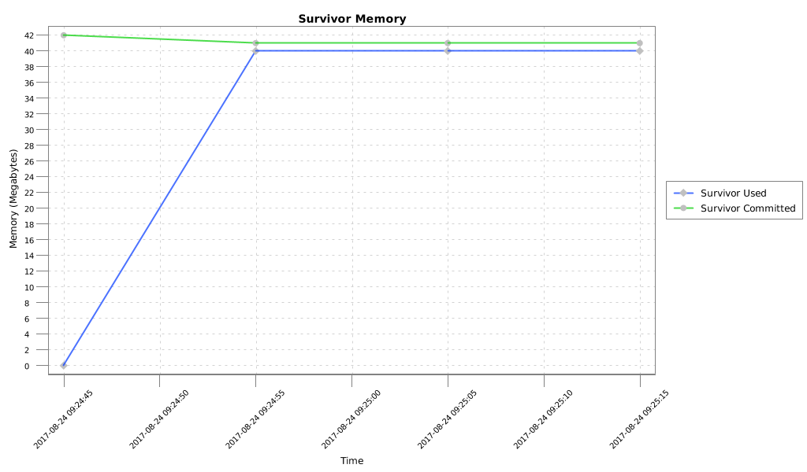
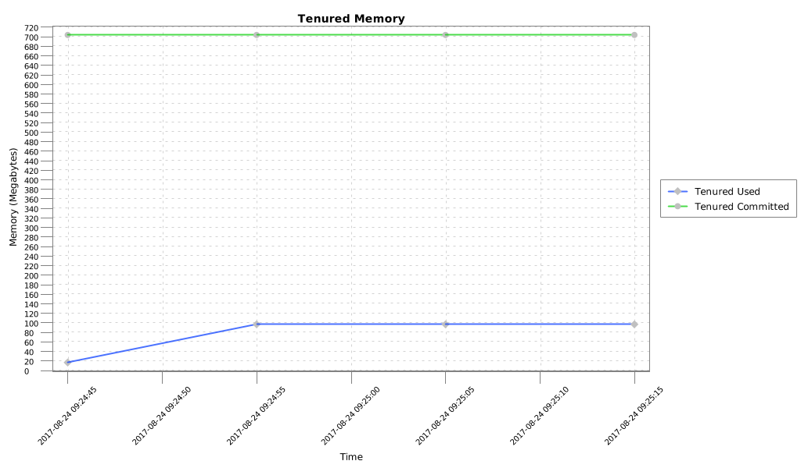

BMIC Data Plotter: A Java library to plot BMIC report Files
============


Introduction
----

This library reads compressed CSV files generated by the BMIC daemon of the [Messaging Performance Test Tool](https://github.com/orpiske/msg-perf-tool/) and plot them. It makes it
easier to integrate processing of those files into custom automation tools without relying on Excel, GNUPlot or
GoogleCharts.
It can be used as a command-line tool or it can be integrated in other projects as a library.


Building
----

```
mvn clean install
```


Using as Command Line Tool
----

Run:

```
./mpt-data-plotter -f /path/to/file.csv.gz
```

Using as Library
----

To use this project as library on your project you have to add my personal 
[bintray](https://bintray.com/orpiske/libs-release/) repository to the pom.xml
file:

```
<repositories>
    <repository>
        <id>orpiske-repo</id>
        <url>https://dl.bintray.com/orpiske/libs-release</url>
    </repository>
</repositories>
```

Then, the library can be referenced as: 
```
<dependency>
    <groupId>net.orpiske</groupId>
    <artifactId>bmic-data-plotter</artifactId>
    <version>1.0.0</version>
</dependency>
```

The API documentation (javadoc) is available [here](http://www.orpiske.net/files/javadoc/bmic-data-plotter-1/apidocs/). 
Additional project documentation is available [here](http://www.orpiske.net/files/javadoc/bmic-data-plotter-1/). 

**Note**: replace version with the latest available version you wish to use.

Output
----

The MDP processing will generate several files per report: 

```
TODO
```

Deploying in Self-Maintained Maven Repository
----

If you maintain your own Maven repository, you can deploy this library using:

```
mvn deploy -DaltDeploymentRepository=libs-snapshot::default::http://hostname:8081/path/to/libs-snapshot-local
```

Samples
----






